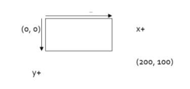

# Intro to graphics


## Graphics Objects


We will draw graphics in Java using 3 kinds of 
objects:
 - DrawingPanel: A window on the screen.
 - Not part of Java; provided by the authors.  
 - Graphics: A "pen" to draw shapes and lines on
a window.
 - Color: Colors in which to draw shapes.
 
 
 - Canvas" objects that represents windows/drawing surfaces
 - To create a window:
`DrawingPanel name = new DrawingPanel(width, height);`
 - Example:
`DrawingPanel panel = new DrawingPanel(300, 200);`
 - The window has nothing on it.
 - We draw shapes / lines on it with another object of type Graphics. 

 - "Pen" or "paint brush" objects to draw lines and shapes
 - Access it by calling getGraphics on your DrawingPanel.
`Graphics g = panel.getGraphics();`
 - Draw shapes by calling methods
on the Graphics object.
`g.fillRect(10, 30, 60, 35);`
`g.fillOval(80, 40, 50, 70);`

## Java Class Libraries

 - Java class libraries: Classes included with Java's 
JDK.
• organized into groups named packages
• To use a package, put an import declaration in your 
program:
```
// put this at the very top of your program
import packageName.*;
```
 - Graphics belongs to a package named java.awt
`import java.awt.*;`
• To use Graphics, you must place the above line at the 
very top of your program, before the public class 
header.

 - Each (x, y) position is a pixel  ("picture element").
 - Position (0, 0) is at the window's top-left corner.
 - x increases rightward and the y increases downward.
 - The rectangle from (0, 0) to (200, 100) looks like 
this:




## Colors
 - Specified as predefined Color class constants:
`Color.CONSTANT_NAME`
where CONSTANT_NAME is one of:
 -  Or create one using Red-Green-Blue (RGB) values of 0-255
`Color name = new Color(red, green, blue);`
• Example:
`Color brown = new Color(192, 128, 64);`


 Pass a Color to Graphics object's setColor method
• Subsequent shapes will be drawn in the new color.

```
g.setColor(Color.BLACK);
g.fillRect(10, 30, 100, 50);
g.drawLine(20, 0, 10, 30);
g.setColor(Color.RED);
g.fillOval(60, 40, 40, 70);
```

Pass a color to DrawingPanel's setBackground method
• The overall window background color will change.

```
Color brown = new Color(192, 128, 64);
panel.setBackground(brown);
```

To draw a colored shape with an outline, first fill it, 
then draw the same shape in the outline color.

```
import java.awt.*;  // so I can use Graphics
public class OutlineExample 
{
    public static void main(String[] args) 
    {
        DrawingPanel panel = new DrawingPanel(150, 70);
        Graphics g = panel.getGraphics();        
        // inner red fill
        g.setColor(Color.RED);
        g.fillRect(20, 10, 100, 50);
        // black outline
        g.setColor(Color.BLACK);
        g.drawRect(20, 10, 100, 50);
    }
}
Outlined shapes
 When ≥ 2 shapes occupy the same pixels, the last drawn "wins."
```

 - When ≥ 2 shapes occupy the same pixels, the last drawn "wins."


```
import java.awt.*;
public class Car 
{
    public static void main(String[] args) 
    {
        DrawingPanel panel = new DrawingPanel(200, 100);
        panel.setBackground(Color.LIGHT_GRAY);
        Graphics g = panel.getGraphics();        
        g.setColor(Color.BLACK);
        g.fillRect(10, 30, 100, 50);        
        g.setColor(Color.RED);
        g.fillOval(20, 70, 20, 20);
        g.fillOval(80, 70, 20, 20);        
        g.setColor(Color.CYAN);
        g.fillRect(80, 40, 30, 20);
    }
}
```


## Drawing with loops

The x,y,w,h expressions can use the loop counter variable:


Nested loops can be used with graphics:


Beginning at 0 and using < can make coordinates easier.

```
DrawingPanel panel = new DrawingPanel(150, 140);
Graphics g = panel.getGraphics();
// horizontal line of 5 20x20 rectangles starting
// at (11, 18); x increases by 20 each time
for (int i = 0; i < 5; i++) 
{
    g.drawRect(11 + 20 * i, 18, 20, 20);
}
```

```
// Draws a Building Java Programs textbook with DrawingPanel.
import java.awt.*;
public class Book 
{
    public static void main(String[] args) 
    {
        DrawingPanel panel = new DrawingPanel(200, 150);
        panel.setBackground(Color.WHITE);
        Graphics g = panel.getGraphics();
        g.setColor(Color.CYAN);            // cyan background
        g.fillRect(20, 35, 100, 100);
        g.setColor(Color.WHITE);           // white "bjp" text
        g.drawString("BJP", 70, 55);
        g.setColor(new Color(191, 118, 73));
        for (int i = 0; i < 10; i++) 
        {     // orange "bricks"
            g.fillRect(20, 35 + 10 * i, 10 + 10 * i, 9);
        }
    }
}
```


```
// Draws many BJP textbooks using parameters.
import java.awt.*;
public class Book2 
{
    public static void main(String[] args) 
    {
        DrawingPanel panel = new DrawingPanel(450, 180);
        panel.setBackground(Color.WHITE);
        Graphics g = panel.getGraphics();
        // draw three books at different locations
        drawBook(g, 20, 35);
        drawBook(g, 150, 70);
        drawBook(g, 300, 10);
    }
    
    / Draws a BJP textbook at the given x/y position.    
    public static void drawBook(Graphics g, int x, int y) 
    {
        g.setColor(Color.CYAN);           // cyan background
        g.fillRect(x, y, 100, 100);
        
        g.setColor(Color.WHITE);          // white "bjp" text
        g.drawString("BJP", x + 50, y + 20);
        
        g.setColor(new Color(191, 118, 73));
        for (int i = 0; i < 10; i++) 
{    // orange "bricks"
            g.fillRect(x, y + 10 * i, 10 * (i + 1), 9);
        }
    }
}
```

```
// Draws many sized BJP textbooks using parameters.
import java.awt.*;
public class Book3 
{
    public static void main(String[] args) 
 {
        DrawingPanel panel = new DrawingPanel(520, 240);
        panel.setBackground(Color.WHITE);
        Graphics g = panel.getGraphics();
        
        // draw three books at different locations/sizes
        drawBook(g,  20, 35, 100);
        drawBook(g, 150, 70,  60);
        drawBook(g, 300, 10, 200);
    }
    ...
     Draws a book of the given size at the given position.
    public static void drawBook(Graphics g, int x, int y, int size) 
    {
        g.setColor(Color.CYAN);            // cyan background
        g.fillRect(x, y, size, size);
        
        g.setColor(Color.WHITE);           // white "bjp" text
        g.drawString("BJP", x + size/2, y + size/5);
        g.setColor(new Color(191, 118, 73));
        for (int i = 0; i < 10; i++) 
        {     // orange "bricks"
            g.fillRect(x,                  // x
                       y + size/10 * i,    // y
                       size/10 * (i + 1),  // width
                       size/10 - 1);       // height
        }
    }
}
```


## Polygon
Objects that represent arbitrary shapes
 - Add points to a Polygon using its addPoint(x, y) method.
 - Example:
```
DrawingPanel p = new DrawingPanel(100, 100);
Graphics g = p.getGraphics();
g.setColor(Color.GREEN);
Polygon poly = new Polygon();
poly.addPoint(10, 90);
poly.addPoint(50, 10);
poly.addPoint(90, 90);
g.fillPolygon(poly);
```
Find a transparent PNG online
 - Copy it to your project folder under  (NetBeans/IntelliJ):
 - Documents\Netbeans Projects\<your project>
 - C:\users\<youruseraccountname>\IdeaProjects\<project>
 - Add imports for: java.awt.*; and javax. imageio.ImageIO;
 - Add code to your project:


```
BufferedImage img = null;
   try
   {
       img = ImageIO.read(new File("bird.png"));  // use your 
filename
       g.drawImage(img, 10, 10, 50, 50, null);    // x, y, w, h 
   } catch (IOException e)
   {
   }
NOTE: if it doesn't draw anything, make sure you put it in the 
right folder, and spelling and capitalization are correct for the 
filename
```

`panel.clear();`
Erases any shapes that are drawn on the drawing panel.
`panel.setWidth(width);`
panel.setHeight(height);
panel.setSize(width, height);
Changes the drawing panel's size to the given value(s).
 panel.save(filename);
Saves the image on the panel to the given file (String).
 panel.sleep(ms);
Pauses the drawing for the given number of milliseconds.
## Docker


